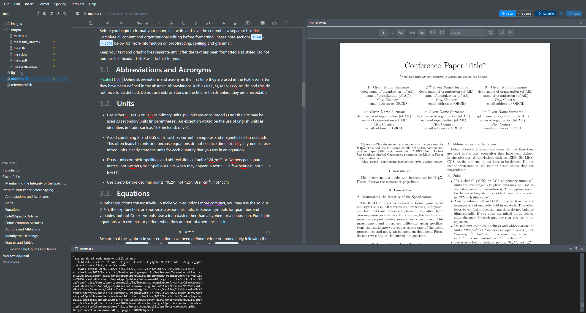

# Texpile Desktop

A local, offline LaTeX editor for Windows, macOS, and Linux. Open a folder, edit your `.tex` files in a visual editor or in source view, compile with your own TeX distribution, and read the PDF next to your text. No account, no cloud, nothing leaves your machine.



## Download

Installers for all three platforms are on [texpile.com/download](https://desktop.texpile.com/download), or directly:

| Platform         | Link                                                                   |
| ---------------- | ---------------------------------------------------------------------- |
| Windows          | [dl.texpile.com/latest/windows](https://dl.texpile.com/latest/windows) |
| macOS            | [dl.texpile.com/latest/mac](https://dl.texpile.com/latest/mac)         |
| Linux (AppImage) | [dl.texpile.com/latest/linux](https://dl.texpile.com/latest/linux)     |
| Linux (.deb)     | [dl.texpile.com/latest/deb](https://dl.texpile.com/latest/deb)         |

Editing works out of the box. To compile PDFs, install a TeX distribution (TeX Live, MiKTeX, or MacTeX) and Texpile runs it for you.

## What it does

- **Visual and source editing of the same file.** The visual editor shows formatted text, math, tables, and figures; the source editor is CodeMirror with LaTeX highlighting, autocomplete, and live math previews. Switch between them at any time.
- **Your `.tex` file stays yours.** There is no internal document format. Saving a file you did not change writes back the exact same bytes. Editing one paragraph regenerates only that block; the rest of the file, including your preamble and any LaTeX the editor does not model, is preserved verbatim.
- **Compile with your own toolchain.** The Compile button runs your command (`latexmk`, `pdflatex`, a Makefile, anything) in a built-in terminal. Multi-file projects are supported, with automatic main file detection.
- **Compile errors as a Problems list.** The LaTeX log (and BibTeX/biber logs) are parsed into errors and warnings with file and line, shown in a panel and inline in the source editor.
- **PDF preview with SyncTeX.** Jump from text to PDF and from PDF back to the exact source line.
- **References.** A `.bib` editor and `@`-citation autocomplete.
- **Source control.** Side-by-side diff against the last commit, staging, and commits, built on your existing git repository.
- **Spell check** runs locally via [Harper](https://github.com/Automattic/harper).
- **Starters** for blank articles, APA, and MLA documents.

## Development

This is a pnpm workspace (pnpm >= 9.2). The renderer is a Svelte 5 + Vite app in `apps/texpile-editor`; the Electron shell lives in `electron/`.

```sh
pnpm install

pnpm electron:dev   # run the app (Vite dev server inside the Electron shell)

pnpm app:build      # build the renderer bundle and compile the Electron TypeScript
pnpm dist           # package installers for the current OS
```

The integrated terminal uses node-pty, a native module. If it reports that it needs a rebuild, run `pnpm electron:rebuild` (requires platform C/C++ build tools).

Tests and checks for the editor app:

```sh
pnpm --filter texpile-editor check       # svelte-check
pnpm --filter texpile-editor lint        # prettier + eslint
pnpm --filter texpile-editor testonce    # unit tests (vitest)
```

## License

[AGPL-3.0](LICENSE.md)
